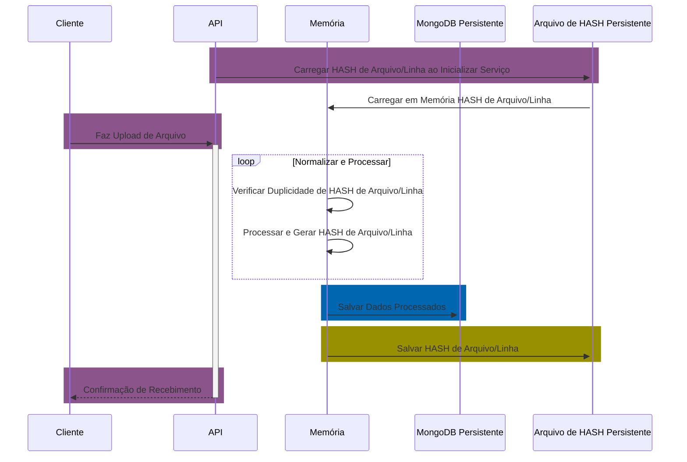
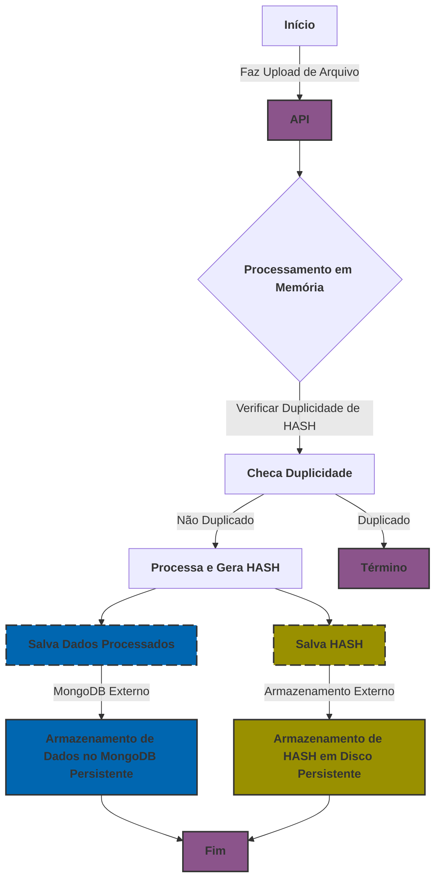

# LuizaLabs Logistics Challenge ORDER-API

Este projeto é uma implementação para o desafio técnico da LuizaLabs/Vertical Logística. O principal objetivo é transformar dados de pedidos desnormalizados de um sistema legado em um formato JSON normalizado, acessível via uma API REST.

## Motivação

Este projeto visa não apenas atender aos requisitos funcionais, mas também garantir a integridade dos dados, prevenir duplicidade e fornecer uma solução escalável e eficiente. A solução proposta busca maximizar a eficiência do processamento de dados e garantir uma armazenagem segura, utilizando técnicas como hashing para controle de duplicidade e armazenamento no MongoDB para persistência robusta.

## Arquitetura do Sistema

A arquitetura deste projeto foi concebida para otimizar o processamento e armazenamento de dados de pedidos, utilizando:

- **Processamento em Memória:** para rápido processamento e transformação de dados.
- **MongoDB:** para persistência de dados processados.
- **Hash de Linha e de Arquivo:** para garantir a integridade e evitar duplicações no processamento de arquivos.

### Diagramas de Arquitetura

#### Diagrama de Sequência


#### Diagrama de Fluxo


## Funcionalidades Principais

- **Upload e Processamento de Arquivos:** permite o upload de arquivos e processa esses dados em memória.
- **Consulta de Pedidos:** filtros por ID do pedido e intervalos de datas.
- **Streaming de Pedidos:** streaming de dados de pedidos em tempo real.

## Tecnologias Utilizadas

- **Node.js**
- **Express**
- **MongoDB**
- **Mongoose**
- **Multer**
- **Crypto** (para geração de hashes)
- **fs** (manipulação de arquivos)

## Configuração e Execução

### Pré-requisitos

- Node.js instalado
- MongoDB operacional localmente ou em um servidor remoto
- Variáveis de ambiente configuradas conforme descrito no arquivo `.env`

### Execução

- **Localmente**:
  ```bash
  npm install
  npm start
  ```

- **Usando Docker**:
  ```bash
  docker-compose up
  ```
Após iniciar a aplicação, você pode acessar o dashboard no seguinte endereço:

- **Dashboard:** [http://localhost:6868/](http://localhost:6868/)
  
  


## Documentação da API

### Swagger UI
A interface do Swagger UI para interação com a documentação da API está disponível nos seguintes endereços após iniciar a aplicação:
- **Swagger UI:** [http://localhost:6868/api/swagger/](http://localhost:6868/api/swagger/)
- **API Docs:** [http://localhost:6868/api/api-docs](http://localhost:6868/api/api-docs)

### Documentação Adicional para Desenvolvimento (Apenas em Modo de Desenvolvimento)
- **Documentos de Desenvolvimento:** [http://localhost:6868/dev-docs](http://localhost:6868/dev-docs) - Documentação adicional para desenvolvedores.
- **Relatórios de Testes:** [http://localhost:6868/test-docs](http://localhost:6868/test-docs) - Relatórios de cobertura de testes.

Essas rotas são configuradas para facilitar o acesso a informações cruciais durante o desenvolvimento e a manutenção da aplicação.

## Contribuição

Sinta-se à vontade para contribuir com este projeto através de pull requests. Por favor, siga as diretrizes de contribuição e o código de conduta.
